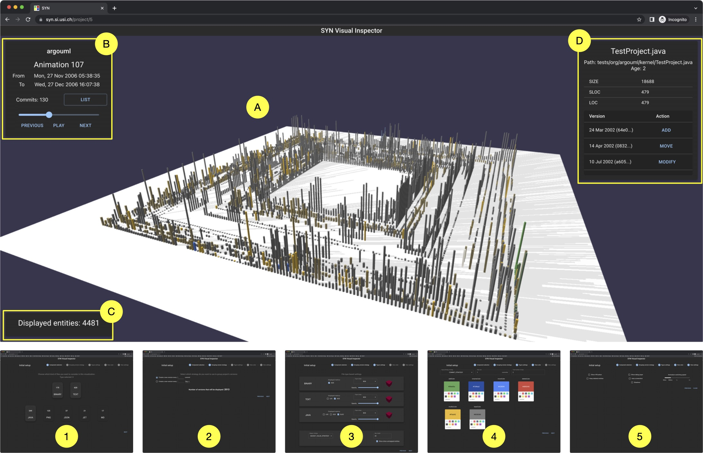

# SYN: Ultra-Scale Software Evolution Comprehension

<a href="https://syn.si.usi.ch">
    
</a>

## About SYN

The comprehension of very large-scale software system evolution remains a challenging problem due to the sheer amount of time-based (i.e., a sequence of changes) data and its intrinsically complex nature (i.e., heterogeneous changes across the entire system source code). It is a necessary step for program comprehension, as systems are not simply created out of thin air in a bang, but are the sum of many changes over long periods of time, by various actors and due to various circumstances.
We present SYN, a web-based tool that uses versatile vi- sualization and data processing techniques to create scalable depictions of ultra-scale software system evolution. SYN has been successfully applied on several systems versioned on GitHub, including the nearly 20-year history of the Linux operating system, which totals more than one million commits on more than 100k evolving files.

## Live DEMO & Video

A live DEMO of SYN is available at its [project homepage](https://syn.si.usi.ch).

A video demonstration of its usage is available on [YouTube](https://www.youtube.com/watch?v=YXytmPp48_E).

## Built With

List of major frameworks/libraries used to bootstrap SYN.

**Frontend**
- ReactJS
- Babylon
- Apollo GraphQL

**Backend**
- Java
- SpringBoot
- JGit

## Getting Started

Build local container images and run SYN by following these simple example steps.

### Prerequisites

* `Docker` needs to be installed in the machine.
* Min. `Java 18` to build the server.

### Building Docker Images

Follow these steps to build and run the SYN docker containers:

1. Clone the repo
   ```sh
   git clone https://github.com/....
   ```
3. Build the backend
   ```sh
   cd syn-backend
   sh build.sh
   cd ..
   ```
4. Build the frontend
   ```sh
   cd syn-frontend
   docker-compose build
   cd ..
   ```

### Usage

1. First, create a project with SYN-CLI using the following command (replace the `:projectName` and `:projectGitHubURL` variables):
   ``` sh
   docker run --rm --volume "$(pwd)/syn_data:/syn_data" -e SYN_HOME=/syn_data syn-cli project create -n :projectName -p :projectGitHubURL
   ```
   For example:
   ``` sh
   docker run --rm --volume "$(pwd)/syn_data:/syn_data" -e SYN_HOME=/syn_data syn-cli project create -n JetUML -p https://github.com/prmr/JetUML
   ```

2. Once the project is created, it can be analyzed with the following command (`-p` is the project id, `-t` is the number of threads):
   ``` sh
   docker run --rm --volume "$(pwd)/syn_data:/syn_data" -e SYN_HOME=/syn_data syn-cli analyze auto -p 1 -t 1
   ```

3. To inspect the analyzed project, spin up the containers:
   ``` sh
   docker-compose up
   ```

4. Finally, open [SYN](http://127.0.0.1:3000/) in a browser.


## License

Copyright (c) 2023 REVEAL @ Software Institute – USI, Lugano.

See [LICENSE](LICENSE) for more information.

## Contacts 

- [Gianlorenzo Occhipinti](https://www.linkedin.com/in/gianlorenzo-o/)
- [REVEAL](https://reveal.si.usi.ch)
